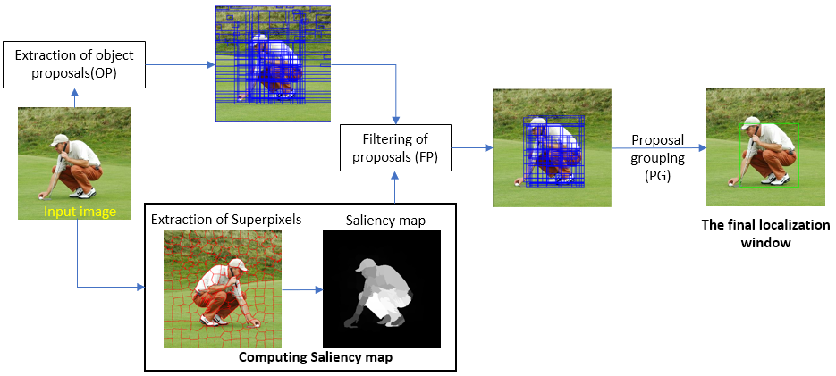

# Unsupervised-Object-Localisation
Implementation of the algorithm proposed in [this paper](./PAPER.pdf). This algorithm addresses Unsupervised single class object localisaation, an important problem of Computer vision. This problem has many applications, for example in object detection, object segmentation, anomaly detection, seperation of foreground and background, etc.

## The Algorithm
This algorithm uses Randomised Prim's alorithm to fisrt extract the object proposals, later it extracts the superpixels using SLIC, which are used to generate the saliency map of the image. The saliency map is used to filter the object proposals to obtain a set of proposals which tightly bound the object. Later spatial pyramid matching and dense SIFT are used to group these proposals to obtain the final localisation window aroung the object.  
The Pipeline of the algorithm can be represented as follows:

## Experimental Results
The performance of the algorithm was tested on two of the most used object discovery datasets namely, PASCAL VOC 2007 and PASCAL VOC 2012. The results show that our approach achieves an average CorLoc of 65.43%, when evaluated on the PASCAL VOC 2007 dataset. The experiments show that our algorithm performs significantly better than other unsupervised approaches, and performs comparably to the state of the art weakly-supervised approach (which achieves an average CorLoc of 64.60%).

## How to run the code?
The code has been written in MATLAB 2017 and C++. To run the code,
- Clone the directory and cd into it.
- The images that are to be tested must be added to the [test_images](./test_images) folder along with the annotation data in .mat format.
- Then run [demo](./demo.m).
- The result images with the localisation window can be found in [result_images](./result_images) folder.
